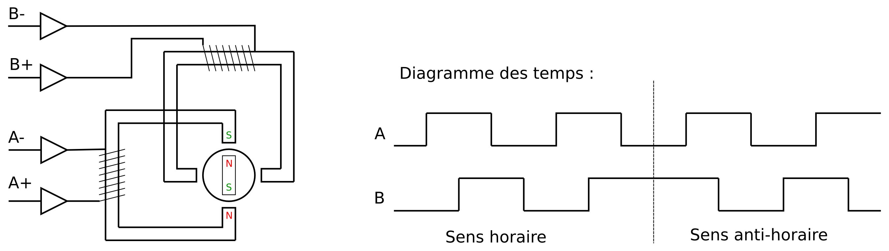

Commande d'un moteur pas-à-pas
==============================

Le principe du moteur pas-à-pas sera donné dans une vidéo de la semaine 7. Le dessin ci-dessous donne déjà une explication simplifiée :



Les enroulements A et B vont chacun produire un champ magnétique dans leur noyau qui peut être Nord-Sud ou Sud-Nord selon le sens du courant.
En imaginant que la partie mobile, représentée par un cercle, est un aimant permanent qui a aussi un pôle Nord et un pôle Sud, on comprend bien que cette partie mobile va changer de position selon le sens du courant dans chaque enroulement.

Le diagramme des temps montre la succession des commandes de chaque enroulement nécessaire pour faire tourner le moteur dans un sens ou dans l'autre. On remarque que le système a 4 états.

Regardez la vidéo de la séquence : [pas-a-pas.mp4](http://pyr.ch/coursera/pas-a-pas.mp4)

On vous demande de créer un générateur manuel de pas. À chaque pression sur le bouton P1, le moteur fait un pas dans le sens horaire. Inversement, à chaque pression sur le bouton P2, le moteur fait un pas dans le sens antihoraire. Le système doit détecter le flanc montant mécanique du bouton et ne pas générer de pas jusqu’au flanc montant suivant. Un seul bouton peut être pressé à la fois.

La table des états du moteur est donnée ci-dessous. On la parcourt cycliquement. Le sens horaire va du haut vers le bas. Le sens antihoraire va du bas vers le haut.

```
 État¹  L2  L1
  00     0   0   ↰
  01     0   1    │
  02     1   1    │
  03     1   0    ┘
```

¹NB : C’est un système codé en [binaire réfléchi](https://fr.wikipedia.org/wiki/Code_de_Gray). L’info n’est pas utile pour résoudre l’exercice, mais c’est toujours bon à savoir.

